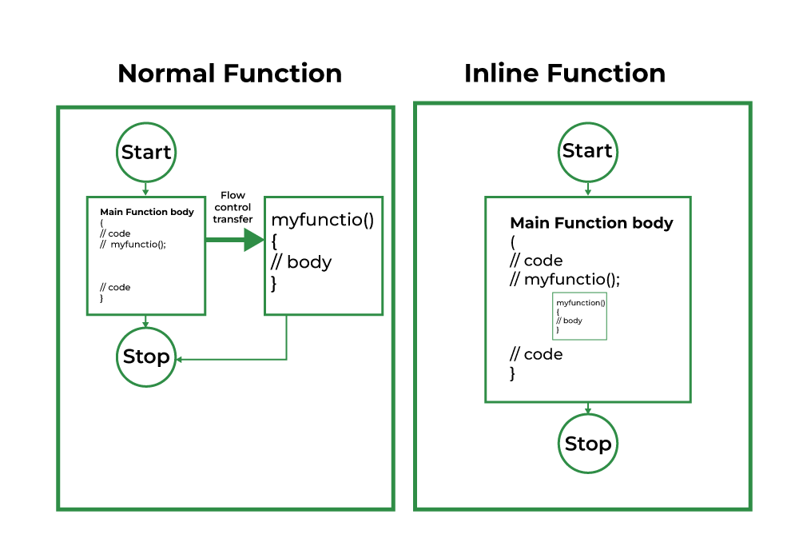
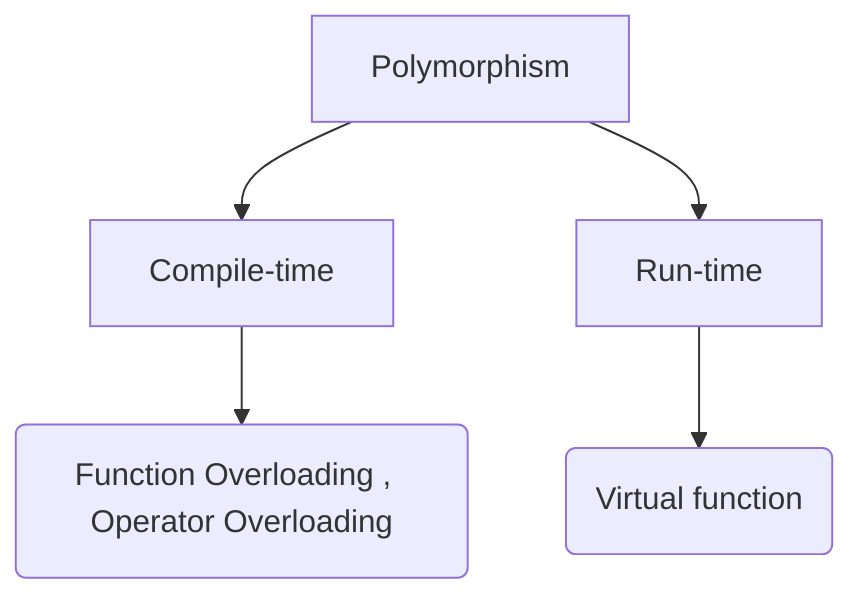

# Function and Polymorphism

## Function :  
* Function is a line of code that produce the solution for the problem set by using the logic which programer write..
* for using function we must `declare`, `define` & `call` the function.
  * Decleration is done in global declaration section, or inside the class.
  * `Defining` is done anywhere in code depending the scope area for defining.
  * `call` is done anywhere in the code depending the scope area. 
* Visit C Programming Function notes for more...
  * [ function ](https://github.com/sahilwep/C_Programming_notes/blob/main/04_Fucntion.md)


> Syntax :
```cpp
#include<iostream>
using namespace std;

// here we can define the function in global deceleration section.
void func(int x ,int y){
    cout << "add is  : "<< x+y ;
}

int main(){
    int a=10,b=10;
    // calling a function.
    func(a,b);

    return 0;
}
```
* Here during the function defining we using `parameter` `x` & `y`
* During the function we use `argument` `a` & `b`


### Function Calling : 
* Function Call is the process of calling the function.
* We have multiple methods to call the function.
* While calling a function, we have two things to consider, 
  * `Formal Parameter` : Formal parameter is used during the defining the function.
  * `Actual Parameter` : Actual parameter is used during the function call 

```cpp
#include<iostream>
using namespace std;

// Here a is Formal parameter
int func(int a){
  cout << "value is : " << a;
}

int main(void){
  int x = 10;
  // Here x is actual parameter, which is pass in function.
  func(int x);

  return 0;
}

```

#### Call by value : 
* Call by value is the easiest method.
* Here we are passing the value only into the actual parameter.
* In formal parameter it create a copy of actual parameter values..

```cpp
#include<iostream>
using namespace std;

int add(int x, int y){
    return x+y;
}


int main(void){
    int a = 2, b = 4;
    cout << "add is  : " << add(a, b);
    return 0;
}
```

#### Call by Address or reference : 

* In Call by address function fetch the address of the actual parameter in formal parameter.

```cpp
#include<iostream>
using namespace std;

void func(int &a){
    a++;
    cout << "\n value of a in func() is : " << a;
}

int main(void){
    int a = 2;
    func(a);
    cout << "\n Value of a in main() is : " << a;
    return 0;
}
```
* Here if the passed value is changed in function, then it also change where from it passed, mean to say here we are getting the address, so if anything is changed in address that will reflect everywhere.

> Explain : 
```cpp
func(int &a) // here address is fetched i.e : 0x123h
{
  a++;  // whatever we change here it will change in memory address i.e : 0x123h
}

int main(void){
  int a = 2;// suppose when we create a, In memory some random address assign to it example : 0x123h
  func(a); // here we are passing the value : a which is 2
}
```

#### Call by pointer or dereference : 

* Inside the function the address is used to access the actual parameter
* In actual parameter we pass the address of the variable.
* In formal parameter we pass the dereferencing to get the value of passed address.

```cpp
#include<iostream>
using namespace std;

void func(int *a){
    *a = *a + 1;
    cout << "\n value of a in func() is : " << *a;
}

int main(void){
    int a = 2;
    func(&a);
    cout << "\n Value of a in main() is : " << a;
    return 0;
}
```
* Here we using the (*) dereferencing to get the value, and then change.
* Here when we change the value, it change everywhere, because we passed address.

---


### Object as function argument
* We can pass the object as function argument.
* While creating a function inside the class we can use the object as a function argument.

> Example : object as argument with normal function  
```cpp
#include<iostream>
using namespace std;

class Abc{
public:
    int marks;
};

void print(Abc obj){
        cout << "marks is : " << obj.marks;
    }

int main(void){
    Abc obj;
    obj.marks = 100;    

    print(obj);
    return 0;
}
```

> Example : object as argument with class function.   
```cpp
#include<iostream>
using namespace std;

class Abc{
public:
    int a;
    void add(Abc obj){
        a = a + obj.a;
    }
};

int main(void){
    Abc obj1,obj2;

    obj1.a = 10;
    obj2.a = 20;
    
    cout << "\nInitial values : ";
    cout << "\nvalues of object 1 : " << obj1.a;
    cout << "\nvalues of object 2 : " << obj2.a;
    cout << "\n\n";   int a = 10;   int a = 10;
    int &b = a;

    cout << endl <<  b;
    cout << endl <<  a;

    int &b = a;

    cout << endl <<  b;
    cout << endl <<  a;


    obj2.add(obj1);

    cout << "\nFinal value : ";
    cout << "\nvalues of object 1 : " << obj1.a;
    cout << "\nvalues of object 2 : " << obj2.a;
    cout << "\n\n";
    
    return 0;
}
```

---

### inline function

* 

* When we call the function inside `main()`, the control transfer to the function definition of called function.
* The address from where the function is called and the definition is different.
* The control transfer takes lot's of time and increase overhead.
* When the `inline` function is encountered, then the definition function is copied to it, In this case there is no control transfer which saves a lot of time and also decreases the overheads.
* If a function is inline then the compiler replaces the function calling location with the defining of the inline function at compile time.
* For defining function as `inline` we use the `keyword` as `inline`.

```plain
<!-- Syntax -->

inline return_type function_name(parameters){
  // code logic
}

int main(){

  function_name();
  return 0;
}
```
> inline function without class
```cpp
#include<iostream>
using namespace std;

inline int add(int a, int b){
    return a + b;
}

int main(void){
    int a = 10, b = 20;
    cout << "add is : "<<  add(a, b) << endl;
    return 0;
}
```
> inline function with class

```cpp
#include<iostream>
using namespace std;

class Abc{
public: 
    inline int add(int a, int b){
        return a + b;
    }
};

int main(void){
    int a = 10, b = 20;
    Abc obj;
    cout << "add is : "<<  obj.add(a, b) << endl;
    return 0;
}
```

* We need the inline function to save memory space.
* Inline function is used when performance is required.

#### Making inline function outside the class
* It is possible to define the inline function inside the class.
* in fact, all the function define inside the class are implicitly inline.
* If we need to declare the inline function in the class then just declare the function inside the class and then define the function outside the class with `inline` keyword.
* Here are example 

> Bad Approach : defining inline function inside the class. 
```cpp
#include<iostream>
using namespace std;

class Abc{
public: 
  inline int add(int a, int b) // redundant use of inline.
  { 
      return a + b;
  }
};

int main(void){
    int a = 10, b = 20;
    Abc obj;
    cout << "add is : "<<  obj.add(a, b) << endl;
    return 0;
}
```
* This style is considered as a bad programming style. The best programming style is to just write the prototype of function inside the class and specify it as an inline in the function definition.  
  
> Good Approach : inline Function defining outside the class.
```cpp
#include<iostream>
using namespace std;

class Abc{
public: 
    int add(int a, int b);
};

inline int Abc::add(int a, int b){
    return a + b;
}

int main(void){
    int a = 10, b = 20;
    Abc obj;
    cout << "add is : "<<  obj.add(a, b) << endl;
    return 0;
}
```
---

### Friend function

* Data hiding is one of the fundamental concept of OOP's. It restrict of access the private member form outside the class, similarly the protected member can only be accessed by derived class and are inaccessible form outside.
* Ex : 

```cpp
class Abc{
private:
  int a;
};

int main(void){
  Abc obj;
  obj.a = 1; // throw error during the compilation.
}
```
* It throw the error during the compilation, that we can't access the member.
* Solution for that we can make a public function and access the member via that function.

```cpp
#include<iostream>
using namespace std;

class Abc{
private:
  int a;
public:
  void func(int x){
    a = x;
  }
};

int main(void){
  Abc obj;
  obj.func(10); // putting the value in a
}
```
* However there is a feature in `C++` called `friend function`, that break this rule and allow to access the members function from outside the class.
* Friend function can access the private and the protected data of a class.
* We can declare the friend function using the keyword : `firend`

```plain
<!-- Syntax -->
friend <access specifier> <return type> <function name>(<parameter list>);
```

```cpp
#include<iostream>
using namespace std;

class Abc{
private:
    int pri_var;
protected:
    int prot_var;
public:
    // constructor assign the value into private & protected variable when object is created.
    Abc(){
        pri_var = 10;
        prot_var = 20;
    }
    friend void friend_func(Abc obj);
};

void friend_func(Abc obj){
    cout << "\n Private variable : " << obj.pri_var;
    cout << "\n Protected variable : " << obj.prot_var;
}


int main(void){
    Abc obj1; // when object is created constructor is called.
    friend_func(obj1);

    return 0;
}
```
* Here we can access the private & protected data using friend function.

---

### Static Data & functions : 

* `static` is a keyword in `C++` used to give the special characteristics to an element.
* Static element are allocated storage `only once` in a program lifetime in static storage area.
* They have scope till the end of program.
* If we don't initialize the static variable, they are by default initialized as `zero`.
* Static keyword can be used as : 
  * Static variable in function.
  * Static Class object.
  * Static member variable in class.
  * Static method in class.

#### Static variable inside the function : 

* Static variable used inside function, and initialized only once, and they hold-there value even though function calls.
* These static variable are stored on static storage not in stack area.
 
```cpp
#include<iostream>
using namespace std;

void func(){

    static int count = 0;
    cout << count++ << " ";
}

int main(void){

    for(int i =0 ;i <= 5 ;i++){
        func();
    }
    return 0;
}
```
* Here variable `count` is static so in for loop only one time the static variable is assigned & update, then if called again the update value will get updated and print output : `1 2 3 4 5`
* In case of normal variable it initialized every time to `0`  whenever the function is called, and get the output as : `0 0 0 0 0`
* Example : 


```cpp
#include<iostream>
using namespace std;

void func(){

    int count = 0;
    cout << count++ << " ";
}

int main(void){

    for(int i =0 ;i <= 5 ;i++){
        func();
    }
    return 0;
}
```


#### Static Data :


* Static data is a type of data which can be accessed without creating an object.
* Whenever we define the data member of a class using static keyword, the data member are called the static data member
* All the object of that class share the same copy of the static member to access the static data.
* To assign the value inside the static data we use a syntax like : `<return type> <class name>::<variable name> = <value>`
 
```cpp
#include<iostream>
using namespace std;

class Abc{
public:
    string name;
    static int member;
    void display(){
        member ++;
        cout << "\n Name is : " << name;
    }
};

int Abc::member = 10;

int main(void){

    Abc obj1;
    obj1.name = "Khushi";
    obj1.display();
    cout << "\n Value of static member is  : " <<  Abc::member;
    

    Abc obj2;
    obj2.name = "Sahil";
    obj2.display();
    cout << "\n Value of static member is  : " <<  Abc::member;

    return 0;
}
```


#### Static function :
* When a function inside the class declare `static`, it can be accessed using the scope resolution operator `::` without creating object.
* Static function is also known as Static Member Function.
* A static member method has accessed only to the static member of the class, we can no call any non-static function inside it.
* `Syntax` : `<static> <return type> <function name>(<arguments>)  `

```cpp
#include<iostream>
using namespace std;

class Abc{
public:
    static string name;
    static void set_name(string a){
        name = a;
    }
    static void print_name(){
        cout << "name is : " << name;
    }
};

string Abc::name = "";

int main(void){
    Abc::set_name("Sahil");
    Abc::print_name();

    return 0;
}
```

## Polymorphism : 

* Word Polymorphism is the combination of "polly" + "morphs" means having many forms.
* There are two types of polymorphism :


###  Compile-time polymorphism :
* This type of overloading achieved by function overloading and operator overloading.
* compile  polymorphism is also know as `Overloading`.

#### Function Overloading : 
* Function Overloading provides multiple definitions of the function by changing signature. i.e. changing number of parameter, changing datatype of parameter, return type doesn't play any role.

```cpp
#include<iostream>
using namespace std;

class Abc{
public:
    // function overloading : 
    void add(int a, int b){
        cout << "\n add is : " << a+b;
    }
    void add(int a, int b, int c){
        cout << "\n add is : " << a+b+c;
    }
    void add(int a, int b, int c, int d){
        cout << "\n add is : " << a+b+c+d;
    }
};


int main(void){
    Abc obj;
    obj.add(1,1);
    obj.add(1,1,1);
    obj.add(1,1,1,1);


    return 0;
}
```

#### Operator Overloading : 
* In Operator Overloading we change the functionality of an operator to behave.
* We know that the operator + is used to add two pre-defined datatype like : `int` , `float` etc, now what if we want to add the two object, it throw the compilation error that datatype is not suitable to add, here come the concept of operator overloading. we redefined the `+` operator to work with another data type.
* like in case of complex addition of any no : 

```cpp
#include<iostream>
using namespace std;

class Complex{
private:
    int real;
    int imag;
public:
    Complex(int r = 0, int i = 0){
        real = r;
        imag = i;
    }
    // changing the functionality of + operator
    Complex operator+(Complex const& obj){
        Complex res;
        res.real = real + obj.real;
        res.imag = imag + obj.imag;
        return res;
    }
    void print(){
        cout << real << " + i" << imag << "\n";
    }  
};


int main(void){
    
    Complex c1(10, 5), c2(2 , 4);
    
    Complex c3 = c1 + c2;
    c3.print();

    return 0;
}
```


###  Run-time polymorphism :
* Run time polymorphism is also know as `Overriding`.
* It can achieve by using `function overriding`
* Run-time polymorphism is also know as `function overriding`
  * It is the redefinition of base class function in its derived class with same signature i.e. return type and parameters. 
  * It can only be done in derived class.

#### Virtual Function : 

* Virtual function (also known as virtual method) is a member function that is declare in base class and is-redefined(overridden) by a derived class.
* We can call the virtual function for that object and execute the derived class's version of the method :     
  * Virtual function ensure that the correct function call regardless of the type of reference(or pointer) used for the function call.
  * They are mainly used to achieve `Runtime Polymorphism`
  * Function are declared with `virtual` keyword in base class.
  * They resolving of a function call is done at runtime.

#### Rules for virtual function :

* The virtual function cannot be static.
* A virtual function can be a friend function of another class.
* Virtual function should be assessed using a pointer or reference of base class type to achieve runtime polymorphism.
* The prototype of virtual function should be the same in base class as well as derived class.
* They are always defined in the base class and overridden in a derived class. it is not mandatory for the derived class to override(or re-define the virtual function), in that case, the base class version of the function is used.
* A class may have virtual destructor but it cannot have virtual constructor.
* Compile time(early binding) Vs runtime (late binding) of virtual function : 

```cpp
#include<iostream>
using namespace std;

class base{
public:
    virtual void print(){
        cout << "\n This is base class ";
    }
    void show(){
        cout << "\n show base class \n";
    }
};

class derived: public base{
public:
    void print(){
        cout << "\n This is derived class ";
    }
    void show(){
        cout << "\n show derived class \n";
    }
};

int main(void){

    base* obj1;
    derived obj2;

    obj1 = &obj2;

    // virtual function, binded at run time
    obj1->print();

    // Non-virtual function, binded at compile time
    obj1->show();
 
    return 0;
}

```
* `Explanation` : The runtime polymorphism  is achieved only through a pointer (or reference) of the base class type. Also, a base class pointer can point to the objects of the base class as well as to the derived class. In the above code, the base class pointer `obj1` contains the address of object `obj2` of the derived class.
* Late binding (`Runtime`) is done accordance with the content of the pointer (i.e. location pointed to by pointer) and Early Binding (compile time) is done according to the type of pointer since the print() function is declare with the virtual keyword so it will be bound at runtime (output is `this is derived class ` as the pointer is pointing to object of derived class) and show() is non-virtual so it will be bound during compile time(output is `show base class` as the pointer is of base type).


#### Limitation of virtual function : 

* `Slower` : The function call takes slightly longer due to virtual mechanism and makes it more difficult for the compiler to optimize because it does not know exactly which function is going to called at compile time.
* `Difficult to debug` : In a complex system, virtual function can make it a little more difficult to figure out where a function is being called from. 


* [Reference : GFG ](https://www.geeksforgeeks.org/virtual-function-cpp/)


---
* `Thanks for reading, support me at : ` :) 
  * [< Github >](https://github.com/sahilwep)
  * [< Website >](https://sahilwep.github.io/)
  * [< Twitter >](https://twitter.com/sahilwep/)
