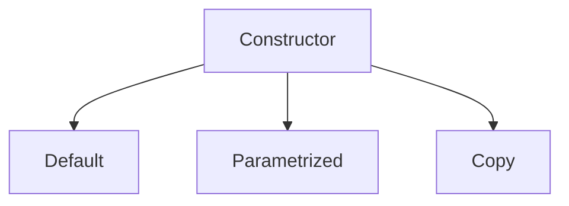

# Constructor and Destructor

## Constructor :

* Constructor is a special method in class which `called automatically` when the object is `created` of of that class.
* Constructor uses the `same name` of their class, Whenever we create class there is always default constructor exist, it just if we want to explicitly declare constructor we can declare method with the same name of the class and that has no return type.
* Constructor has :
  * The same name as class
  * No return type

> Syntax of constructor 
```cpp
class classname{
public:
    // declaring Constructor
    classname(){
        ...
        ...
        }
};
```

* Types of constructor


## Default Constructor :

* Default constructor is constructor which doesn't take any `argument` and has `no parameter`.

```cpp
#include<iostream>
using namespace std;

class Abc{
public:
    // declaring Default constructor
    Abc(){
        cout << "constructor called! ";
    };

};

int main(){    
    // creating an object.
    Abc obj;
    
    return 0;
}
```

## Parametrized constructor :

* The constructor which has parameters while defining it, we say parametrized constructor.
* In parametrized constructor when we create object of the class we have to pass the value while creating the object.

```cpp
#include<iostream>
using namespace std;

class Abc{
public:
    // declaring Parametrized constructor
    Abc(int a){
        cout << "constructor value pass is : " << a;
    };

};

int main(){  
    // creating an object with passing the value.
    Abc obj(10);
    
    return 0;
}
```

## Copy Constructor :
* Copy constructor is `member` `function` which initializes an object using another object of the same class.
* A copy constructor create a new object, which is exact copy of existing object.
* The compiler provides a default copy constructor to all the classes.

> syntax:
```cpp
class classname{
public:
    classname(classname &){
        ...
        ...
    }
};
```
* If we don't define our own copy constructor, the C++ compiler creates a default copy constructor for each class.
* We need to define our copy constructor only if an object has a pointer or any runtime allocation of the resource like file-handling, or network connection etc.

> Example :
```cpp
#include<iostream>
using namespace std;

class Abc{
private:
    int roll;
    string name;
    int marks;
public:

    // normal constructor
    Abc(int Roll, string Name, int Marks){
        roll = Roll;
        name = Name;
        marks = Marks;
    }

    // copy constructor
    Abc(Abc &obj){
    roll = obj.roll;
    name = obj.name;
    marks = obj.marks;
    }
    // display function
    void display(){
        cout << "\nname = " << name << "\nroll = "<< roll<< "\nmarks = "<< marks;
    }
};

int main(){

    Abc obj(1,"sahil",100);
    obj.display();

    // calling copy constructor..
    Abc obj2(obj);
    cout << "\nCopy constructor called..";
    obj2.display();


    return 0;
}
```
## Multiple Constructor :
* We can define multiple constructor in class..
* With declaring multiple constructor & with this we can achieve `Constructor` `overloading`.

```cpp
#include<iostream>
using namespace std;

class Abc{
private: 
    int *ptr;
public:
    // declaring multiple constructors
    Abc(){
        cout << "\n Constructor called! ";
    }
    Abc(int a){
        cout << "\n Constructor called! value pass is : " << a;
    }
    Abc(int a, int b){
        cout << "\n Constructor called value pas is : " << a << " and " << b;
    }
};

int main(){

    Abc obj;
    Abc obj1(3);
    Abc obj2(3,4);

    return 0;
}
```


### Constructor Overloading :
* Constructor overloading works same as method overloading, We can achieve constructor overloading by defining multiple constructor as long as each has different list of arguments.
* A constructor is called depending upon the number and type of arguments are passed.
* While creating an object, arguments are passed to let the compiler know, which constructor needs to be called.

> Example :
```cpp
#include<iostream>
using namespace std;

class sum{
private:
    int result;

public:
    // multiple constructors
    // Constructor Overloading
    sum(int a){
        result = a;
    };
    sum(int a, int b){
        result = a+b;
    }

    void display(){
        cout << "the sum is : "<< result;
    }

};

int main(){
    // Creating an objects with passing arguments.
    sum obj(0);
    sum obj2(2,3);
    obj2.display();

    return 0;
}
```


## Dynamic Constructor :

* When allocation of memory is done dynamically using dynamic memory allocator `new` in constructor, it is known as dynamic constructor.
* The constructor which allocate memory that can be accessed by an object at `run-time`.
> Example 1 : This program will dynamically allocate memory. 
```cpp
#include<iostream>
using namespace std;

class Abc{
private:
    const char* p;
public:
    Abc(){
        // allocating memory at runtime
        p = new char[5];
        p = "Hello";
    }

    void print(){
        cout << p << endl;
    }

};

int main(){
    Abc obj;
    obj.print();

    return 0;
}
```
> Example 2 : This program will dynamically allocate memory.  
```cpp
#include<iostream>
using namespace std;

class Abc{
private:
    int* p;
public:
    Abc(){
        // allocating memory at runtime
        // add initialization
        p = new int[5]{1,2,3,4,5};
    }

    void print(){
        for(int i = 0;i <5;i++){
            cout << p[i]<< " ";
        }
    }

};

int main(){
    Abc obj;
    obj.print();

    return 0;
}
```

### What is default argument?
* When we are creating the method or function we use arguments during the deceleration, here we use some default values to the arguments..
> Example : Default Arguments..
```cpp
#include<iostream>
using namespace std;

class Abc{
public:
    void sum(int a, int b, int c = 0,int d = 0){
        cout << "\nsum is : " << a + b + c + d ;
    }    
};

int main(){
    Abc obj;
    obj.sum(1,1);
    obj.sum(1,1,1);
    obj.sum(1,1,1,1);
    return 0;
}
```
### Constructor with default arguments:
* When we create the constructor we pass some default values in it...

```cpp
#include<iostream>
using namespace std;

class sum{
public:
    sum(int a, int b, int c = 0,int d = 0){
        cout << "\nsum is : " << a + b + c + d ;
    }    
};

int main(){
    sum obj1(1,1);
    sum obj2(1,1,1);
    sum obj3(1,1,1,1);
    
    return 0;
}
```
## Dynamic initialization of an object & constructor:
* Dynamic initialization of an object is refers to initializing the object at run time..
* It can achieved by using `constructor` and passing `parameters` to constructor. 
* The memory is `allocated` at run-time by using `new` operator and similarly, `deallocated` at run-time by using `delete` operator.

>Example 1 : Creating dynamic constructor 
```cpp
#include<iostream>
using namespace std;

class Abc{
private:
    int *ptr;
public:
    Abc(){
        ptr = new int;
        *ptr = 10;
    }
    void print(){
        cout << "value inside pointer is : " << *ptr;
    }

};

int main(){
    Abc obj;
    obj.print();
    return 0;
}
```
> Example 2: Creating Object & Constructor dynamically 
```cpp
#include<iostream>
using namespace std;

class Abc{
private:
    int *ptr;
public:
    // creating constructor dynamically..
    Abc(){
        ptr = new int;
        *ptr = 10;
        cout << "\nconstructor called";
    }
    void print(){
        cout << "\nvalue inside pointer is : " << *ptr;
    }

};

int main(){
    // creating an object dynamically..
    Abc *obj;
    obj = new Abc[3];
    // while calling the pointer type object we use (->) operator..
    obj->print();
    return 0;
}
```
#### Deallocating objects dynamically
* Like we create an object dynamically using `new` keyword, same we use the `delete` keyword to deallocate an object.
* This will free our memory.

> Example : This code will dynamically allocate constructor and objects, then deallocate the objects from memory.

```cpp
#include<iostream>
using namespace std;

class Abc{
private:
    int *ptr;
public:
    Abc(){
        ptr = new int;
        *ptr = 10;
        cout << "\nconstructor called";
    }
    void print(){
        cout << "\nvalue inside pointer is : " << *ptr;
    }

};

int main(){
    // creating the pointers objects
    Abc *obj;
    Abc *obj2;

    // making the objects as dynamic 
    obj = new Abc;
    obj2 = new Abc;

    // assigning the obj1 to obj2
    obj2 = obj;

    // printing the function
    obj->print();
    obj2->print();

    // deleting the object
    delete obj;
    return 0;
}
```


## Destructor :
* A destructor works opposite to constructor.
* It destruct the object of the class.
* It can only define once in class.
* Like Constructor it invoke automatically.
* Destructor called when all the members are called of the class of that object.
* Destructor can be define like constructor, but it is prefixed with tilde `~` sign.

> Syntax:
```cpp
class classname{
public::
    ~classname(){
        ...
        ...
    }
};
```

> Example:
```cpp
#include<iostream>
using namespace std;

class Abc{
private:
    int* p;
public:
    Abc(){
        cout << "\nconstructor called..";
    }
    void print(){
        cout << "\nhello world";
    }
    ~Abc(){
        cout << "\ndestructor called..";
    }
};

int main(){
    Abc obj;
    obj.print();
    
    return 0;
}
```

> Thanks! 
> Visit [Github](https://github.com/sahilwep)
> Support [Sahilwep](https://sahilwep.github.io)


