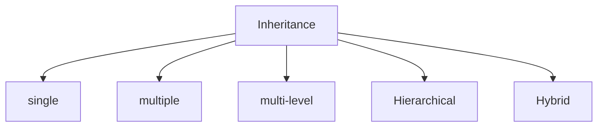
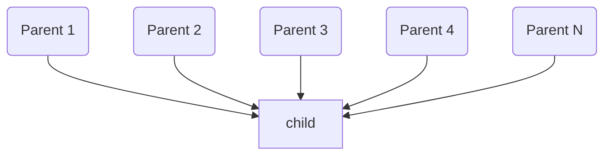
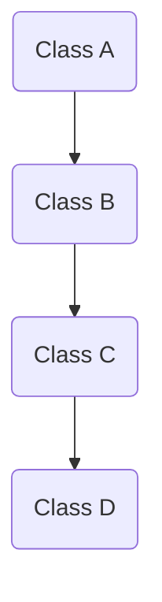
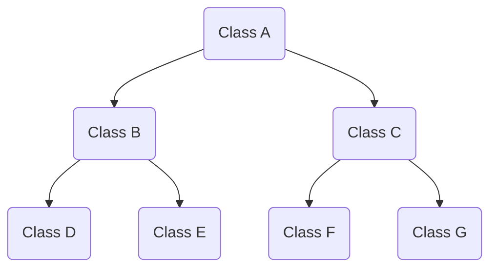
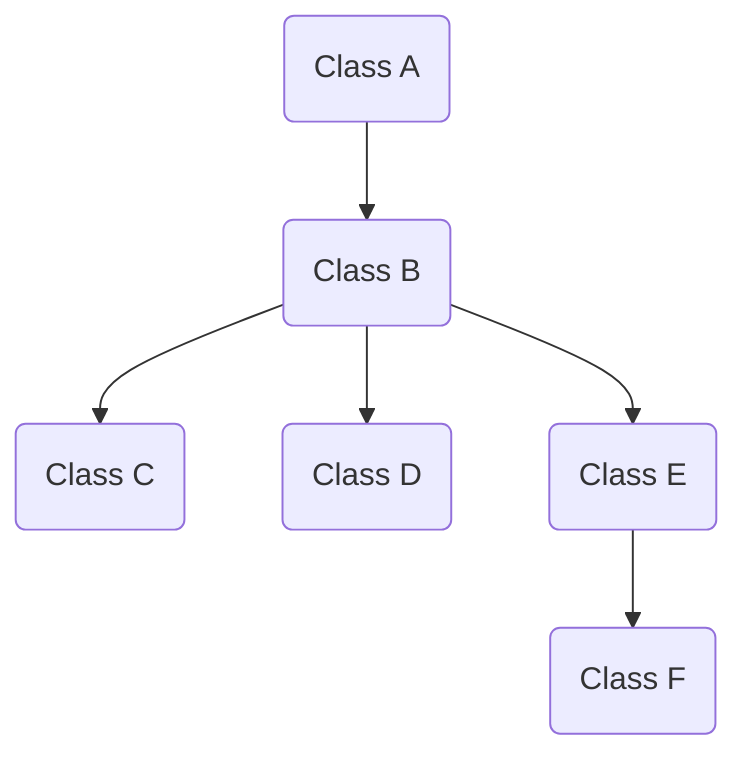
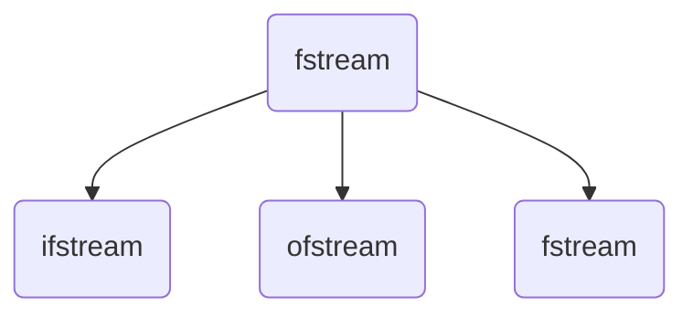

# Inheritance and files :

## Inheritance :
* Inheritance is a way by which one class inherit the property of another class.
* By Inheritance we can program our code intelligently..
* During the inheritance we use the visibility mode which we know as the name `Access-specifier`.
* If we didn't specify the visibility mode, then in this case the mode will be `private`   
* There are mainly five types of inheritance..


### Visibility Mode :

|Base Class | Parent | Parent | Parent | 
|---|---|---|---|---|
|Mode  | Public | Private | Protected | 
|Private | `Not Inherit` | `Not Inherit` | `Not Inherit` |
|Protected | `Protected` | `Private` | `Protected`|
|Public | `Public` | `Private` | `Protected`|

### Single Inheritance :

* In Single inheritance one parent class is inherit into the one child class.
* Single inheritance is one of the basic mode of the inheritance.


> Example : 
```cpp
#include<iostream>
using namespace std;

class Parent{
public:
    int x;
    void get();
};

void Parent::get(){
    cout << "Enter any No : ";
    cin >> x;
}

// single inheritance 
class Child:public Parent{
    public:
void print();
};

void Child::print(){
    cout << "\nInput no is : "  << x;
}

int main(void){
    Child obj;
    obj.get();
    obj.print();

    return 0;
}
```


### Multiple Inheritance : 
* In Multiple Inheritance multiple parent class properties are inherit into one child class.




> Example : 
```cpp
#include<iostream>
using namespace std;

class Class_A{
public:
    Class_A(){
        cout << "\nClass A Constructor called ";
    }
    ~Class_A(){
        cout << "\nClass A Destructor called ";
    }
};

class Class_B{
public:
    Class_B(){
        cout << "\nClass B Constructor called ";
    }
    ~Class_B(){
        cout << "\nClass B Destructor called ";
    }
};

class Class_C{
public:
    Class_C(){
        cout << "\nClass C Constructor called ";
    }
    ~Class_C(){
        cout << "\nClass C Destructor called ";
    }
};

// Inherit child class...
class Child_class:public Class_A, public Class_B, public Class_C{

public:
    Child_class(){
        cout << "\nChild Class Constructor called ";
    }
    ~Child_class(){
        cout << "\nChild Class Destructor called ";
    }
};


int main(void){
    Child_class obj;

    return 0;
}
```
```plain
<!-- Output  -->

Class A Constructor called 
Class B Constructor called 
Class C Constructor called 
Child Class Constructor called 
Child Class Destructor called 
Class C Destructor called 
Class B Destructor called 
Class A Destructor called
```
* Here During the inheritance the sequence of constructor and destructor called sequence is opposite.
  
#### Ambiguity :
* There is a Problem in Multiple Inheritance, i.e `Ambiguity` 
* Ambiguity arises when we have same name of function inside the multiple class and after inheriting into the child class, when we create and object of child class, the compiler get confused that form which class that same-name function should call.. 
* To solve the problem we use the `::` scope resolution operator to explicitly specified that from which class of that fucntion is called...
* Here is solution for that.


> Example : 
```cpp
#include <iostream>
using namespace std;

class A
{
public:
    void func()
    {
        cout << "\nFirst  run ";
    }
};

class B
{
public:
    void func()
    {
        cout << "\nSecond  run ";
    }
};

// method overriding
class C : public A, public B
{
public:
    void func()
    {
        cout << "\nThird run";
    }
};

// solve the problem of ambiguity.

int main()
{
    // call the function with specifying the class name and then function to overcome from the ambiguity.
    C obj;
    obj.A::func();
    obj.B::func();
    obj.C::func();
    obj.func();
    return 0;
}
```

### Multi-Level Inheritance :

* In Multi-level Inheritance, we have Inheritance in levels.



> Example : 
```cpp
#include<iostream>
using namespace std;

class Class_A{
public:
    void car(){
        cout << "\n car is Toyota ";
    }
};

class Class_B:public Class_A{
public:
    void model(){
        cout << "\n car model is fortuner ";
    }
};

class Class_C:public Class_B{
public:
    void color(){
        cout << "\n color is red ";
    }
};

class Class_D:public Class_C{
public:
    void year(){
        cout << "\n Launch year is : 2022 ";
    }

};

int main(void){
    Class_D obj;
    obj.car();
    obj.model();
    obj.color();
    obj.year();

    return 0;
}
```

### Hierarchical Inheritance :

* In hierarchical Inheritance, we have hierarchical structure of classes.
* Like a tree Structure, we have parent class and then they have child's, and child's have sub-child's... 



> Example : 

```cpp
#include<iostream>
using namespace std;

// Parent ---

class Class_A{
public:
    void LPU(){
        cout << "\n Welcome to LPU ";
    }
};

// Class B ---

class Class_B:public Class_A{
    public:
        void SCA(){
            cout << "\n School of Computer Application ";
        };
};

class Class_D:public Class_B{
    public:
        void BCA_Regular(){
            cout << "\n BCA Simple ";
        };
};
class Class_E:public Class_B{
    public:
        void BCA_Hons(){
            cout << "\n BCA Hons ";
        };
};

// Class C ---

class Class_C:public Class_A{
    public:
        void CSE(){
            cout << "\n Computer Science Engineering ";
        };
};

class Class_F:public Class_C{
    public:
        void Regular(){
            cout << "\n CSE Regular Simple ";
        };
};

class Class_G:public Class_C{
    public:
        void Hons(){
            cout << "\n CSE Hons ";
        };
};

int main(void){
    
    // from class B level 
    Class_D obj2;
    obj2.LPU();
    obj2.SCA();
    obj2.BCA_Regular();

    cout << "\n\n";
    
    // from class C level 
    Class_G obj;
    obj.LPU();
    obj.CSE();
    obj.Hons();

    return 0;
}
```

### Hybrid Inheritance :
* In Hybrid Inheritance, we have multiple types of inheritance is combined together to form the hybrid inheritance.


> Example : 
```cpp
#include<iostream>
using namespace std;

// Parent ---

class Class_A{
public:
    void LPU_Group(){
        cout << "\n Welcome to LPU Group ";
    }
};

// level 2
class Class_B:public Class_A{
    public:
        void University(){
            cout << "\n Welcome to University ";
        }
};

// level 3

class Class_C:public Class_B{
    public:
        void SCA(){
            cout << "\n School of computer application ";
        }
};

class Class_D:public Class_B{
    public:
        void CSE(){
            cout << "\n Compter science engineering ";
        }
};

class Class_E:public Class_B{
    public:
        void BBA(){
            cout << "\n Bachelors in business administration  ";
        }
};

// level 4

class Class_F:public Class_E{
    public:
        void BBA_Hons(){
            cout << "\n Bachelors in business administration Hons in finance ";
        }
};

int main(void){
    
    // from level 3 Class C
    Class_C obj;
    obj.LPU_Group();
    obj.University();
    obj.SCA();
    cout << endl;

    // from level 3 Class D
    Class_D obj2;
    obj2.LPU_Group();
    obj2.University();
    obj2.CSE();
    cout << endl;

    // from level 3 Class E
    Class_E obj1;
    obj1.LPU_Group();
    obj1.University();
    obj1.BBA();
    cout << endl;

    // from level 4 Class F
    Class_F obj3;
    obj3.LPU_Group();
    obj3.University();
    obj3.BBA();
    obj3.BBA_Hons();
    cout << endl;

    return 0;
}
```


## Files Handling : 

* The I/O system of C++ Contain Set of classes which define the file handling. These include `ifstream`, `ofstream` and `fstream` classes. These classes are derived from the `fstream` and from corresponding `iostream` class. These class are designed to manage the disk file.
* File store data permanently in a storage device, with file handling the output form a program can store in files.
* For Using the file handling classes we need to include the `fstream` library header into the global decelerations section.  :


```cpp
#include<fstream>
```


* The `fstream` provide C++ program with three classes for working with files. These classes incude : `ofstream`, `ifstream`, `fstream`.
  * `ofstream` : This represent output stream, it used for creating file and writing information to file.
    * It contain `open()` function in default output mode.
    * Inherit the function `put()`, `write()`, `seekp()` and `tellp()`. 
  * `ifstream` : This class represent an input stream, it used for reading information data from file.
    * It contain `open()` function in default input mode.
    * Inherit the function `get()`, `getline()`, `read()`, `seekg()` and `tellg()`.
  * `fstream` : This class generally represent a file stream. it comes with ofstream/ifstream capabilities, which means it can capable to creating files, writing to file, reading data from file.
    * The `fstream ` support simultaneous input output operation.
    * Inherit all the function from `ifstream` and `ofstream` classes through `iostream`




### How to achieve file handling 

* For achieving file handling we need to flowing steps :
    1. Naming of file
    2. Opening of file
    3. Writing data into a file
    4. Reading data from file
    5. closing a file

### fstream Class :

#### Modes : 
* Modes are used in default `open()` function in `fstream`.

|Mode |Description|
|-----|-----------|
|`ios::in`|File opened in reading mode.|
|`ios::out`|File opened in write mode.|
|`ios::app`|File opened in append mode.|
|`ios::ate`|File opened in append mode, but read and write performed at end.|
|`ios::trunc`|File opened in truncated mode.|

* We can use multiple mode with `|` OR operator.

#### Opening File : 
* First we create the `fstream` object to perform the operation in files.
* To open a file we need to use the `open()` function.
* Here we use `ios::out` which allow us to write into a file.
* We use `If` condition to check the file creation, and print the message which define file is created or not.
* At the end we use `close()` method that define the file is closed. 

```cpp
#include <iostream>
#include <fstream>
using namespace std;

int main(){
    // creating an object from fstream library..
    fstream demo_file;
    demo_file.open("demo.txt", ios::out);
    if (!demo_file){
        cout << "Error while creating file" << endl;
    }
    else{
        cout << "File created successfully" << endl;
        demo_file.close();
    }
 
    return 0;
}
```
#### Writing to File :
* For writing we use the `ios::out`, which write the data into the file.
* For writing into the file we use the `<<` insertion operator.
* We can write into a file with multiple method : 

> Method 1 : We can directly pass the content within the (" ") Double quotes...

```cpp
#include <iostream>
#include <fstream>
using namespace std;

int main()
{
    fstream demo_file;
    demo_file.open("demo.txt", ios::out);
    if (!demo_file){
        cout << "Error while creating file" << endl;
    }
    else{
        cout << "File created successfully" << endl;
        // here  we can use <<  & (" ") double quote to write into the file...
        demo_file<<"This is the content that i want to write into the file...";
        cout << "\nWriting into a file is done ";
        demo_file.close();
    }
    return 0;
}
```

> Method 2 : We can use the variable and store the data, and pass into the "<<"  ..

```cpp
#include <iostream>
#include <fstream>
using namespace std;

int main()
{
    string data = "Hello World! ";
    fstream demo_file;
    demo_file.open("demo.txt", ios::out);
    if (!demo_file){
        cout << "Error while creating file" << endl;
    }
    else{
        cout << "File created successfully" << endl;
        // here  we can use <<  & (" ") double quote to write into the file...
        demo_file<< data;
        cout << "\nWriting into a file is done ";
        demo_file.close();
    }
    return 0;
}
```

#### Reading from the file.

* For Reding the file we use `ios::in` mode in default `open()` function.
* Here first we open the file..
* Then we use the condition `if` for open or not..
* Then use the while loop that print the each character of file...
* Then we create the variable that hold the each character...
* Then we provide the `if` condition, that define if our content of the file is finished then it exit, else print the each character..  

```cpp
#include <iostream>
#include <fstream>
using namespace std;

int main()
{
    // creating the object that handle file operation...
    fstream demo_file;
    // opening the file...
    demo_file.open("demo.txt",ios::in);
    if(!demo_file){
        cout << "file not exist! ";
    }
    else{
        cout << "File Open successfully! \n";
        // reading from a file..
        // created a variable that read the file content..
        char ch;
        // making a loop that print the each word of file..
        while (1){
            // using ( >> ) exertion operator we put the content into the ch variable that print...
            demo_file>>ch;

            // use condition, if the cursor gets to the end of file then, loop stop..
            if(demo_file.eof()){
                break;
            }
            // else print the each character...
            else{
            cout << ch;
            }
        }
    }
    demo_file.close(); 
    return 0;
}
```

#### Closing the file.

* For closing the file we use the `close()` function at the end of program to close the file.

> Simple program to close the file after reading the content of file...
```cpp
#include<iostream>
#include<fstream>
using namespace std;

int main(void){

    fstream demo_file;
    demo_file.open("my_file.txt", ios::in);
    if(!my_file.txt){
        cout << "File no exist";
    }
    else{
        cout << "file Open successfully";
        char ch;
        while(1){
            demo_file>>ch;
            if(demo_file.eof()){
                break;
            }
            else{
                cout << ch;
            }
        }
    }
    // here we are closing the file after the operation is done..
    demo_file.close();

    return 0;
}

```

#### Program that create, open, read & write into the file...

* This is a simple program that create a file then open & write content into it & then it read the content that we write in the file.. 

```cpp
#include<iostream>                        
#include <fstream>                        
using namespace std;
int main() {
    // creating file handling object;
    fstream demo_file;      
    
    // Creating a file and writing into it...
    demo_file.open("demo.txt", ios::out);
    if(!demo_file){
        cout << "file not created !";
    }
    else{
        cout << "file is created";
        demo_file<<"here is the content that i want to write int the file..";
    }
    demo_file.close();

    // Opening a file to read the content...
    demo_file.open("demo.txt", ios::in);         
    if (!demo_file) {                        
        cout << "File not exist ";          
    }
    else {
        char x;                     
        while (1) {         
            demo_file>>x;              
            if(demo_file.eof()) {
                break;              
            }         
            else{
            cout<<x;
            }
        }
    }
    demo_file.close();                   
    return 0;
}
```


### ifstream Class :

* `ifstream` class is used for reading form the files...
 
```cpp
int main(void){

    // Open a file and read the data from the file..

    // opening the file..
    ifstream obj_file("file_name.txt");
    // condition for reading the file..
    if(obj_file.is_open()){
        // making variable to store the character from file...
        char ch;
        // good() function return true if the end of file is not reached or any error..
        while (obj_file.good()){
            // get() function read from obj_file and store into the ch variable...
            ch = obj_file.get();
            // print the character that we are reading...
            cout << ch;
        }        
    }
    // close the file after the operation is done...
    obj_file.close();
    return 0;
}
```

### ofstream Class : 

* `ofstream` class is used for writing into the file...

```cpp
#include<iostream>                        
#include <fstream>                        
using namespace std;


int main(void){

    // this will create a file and write the data into the file..

    // creating the file & open it..
    ofstream obj_file("file_name.txt");

    // writing into the file...
    obj_file<<" Hello world! ";
    obj_file<<" This is the content that we are writing into the file..." ;

    obj_file.close();
    
    return 0;
}
```